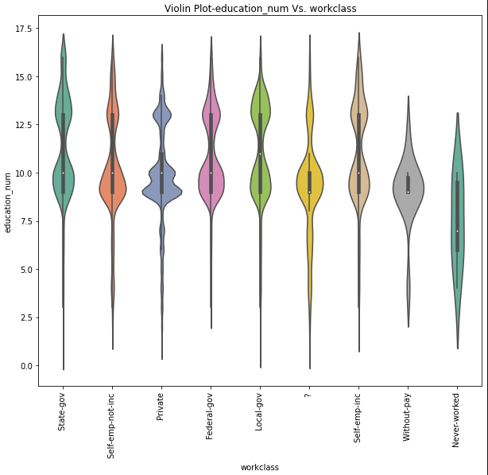

# Income-Prediction

## Background
Machine learning model  to predict whether income exceeds $50K/yr based on us census data.

## Data Source
https://archive.ics.uci.edu/ml/datasets/Census%2BIncome

## Data cleaning
After reading the data, I cleaned it up so that it is usable for our model. I made the following changes using pandas:

* Selected only important columns
* Removed rows with nan values
* Replacing '?' with 'Unknown'

## Data visulization
Different plots i.e., box plot, scatter plot, violin plot, bar plot were created using matplotlib and seaborn to visualize the data.  

## Preprocessing: 
### Train test split
20 percent of data is split for testing using scikit learn train test split.
### Scaling the data
Used `StandardScaler` to scale the training and testing sets. 
### Converting categorical data to numeric
Categorical data were converted to numeric  using `pd.get_dummies()`.

## Model Building
Created different classification models on this data. Different models are:
* Stochastic Gradent Descent Classifier
* Logistic Regression
* KNeighbors Classifier
* Support Vector Classifier
* Decision Tree Classifier
* Random Forest Classifier
* Extremely Random Trees
* Boosting- AdaBoostClassifier

## Tuning hyperparamaters for all model
* Grid Search CV
* Randomized Search CV

## Trying to improve score by selecting important features 
Using SelectFromModel to fit the Adaboster Classifier model and get the important features only to fit all the model desceribed above.

## Model Performance

### Model Performance after selecting only important features

### Model Performance after Grid Search CV or Randomized Search CV

## Comparing real and predicted value using different value for sample test set

